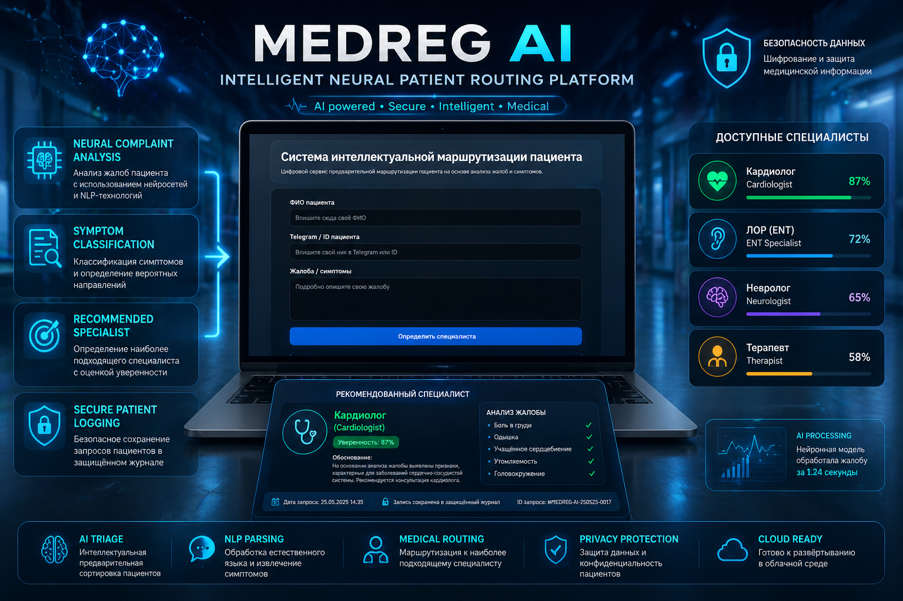

<div align="center">


</div>

---

<div align="center">

[]()
[]()
[]()
[]()

</div>

---

## 🧠 System Overview

**MEDREG AI** is an intelligent medical routing platform designed to automate the initial processing of patient complaints using natural language neural analysis.

The system receives free-form symptom descriptions, analyzes complaint semantics, estimates the most relevant medical specialty, and generates a preliminary patient routing recommendation.

This solution is designed as a prototype of next-generation digital medical registries and AI-assisted healthcare front desks.

---

## 🖥 Platform Showcase

<div align="center">
  
</div>

<div align="center">

**Patient complaint → Neural symptom parsing → Specialist recommendation → Secure logging**

</div>

---

## ⚙ Clinical Workflow Engine

```txt
Patient enters name and complaint
            ↓
Natural language symptom preprocessing
            ↓
Bi-LSTM / Transformer complaint classification
            ↓
Medical specialty probability estimation
            ↓
Recommended physician generation
            ↓
Encrypted patient log creation
```

---

## 🧬 Neural Core Architecture

| Module | Function |
|--------|----------|
| NLP Tokenizer | symptom text vectorization |
| Neural Classifier | complaint semantic recognition |
| Medical Routing Layer | specialist matching |
| Confidence Scoring | urgency / recommendation ranking |
| Secure Logger | encrypted medical request storage |

Medical AI systems require not only model inference but reproducible software architecture, privacy-aware logging and clinically understandable outputs — the same direction emphasized in modern healthcare AI engineering frameworks. :contentReference[oaicite:1]{index=1}

---

## 🏥 Supported Medical Specialties

<div align="center">

ENT • Pulmonologist • Cardiologist • Gastroenterologist • Neurologist • Dermatologist • Surgeon • Dentist • Ophthalmologist • Therapist

</div>

---

## 🧪 Core Technologies

<div align="center">

</div>

- PyTorch neural text classifier
- FastAPI / Web medical interface
- Telegram integration
- encrypted Excel medical logging
- deployable cloud demo architecture

---

## 🔐 Data Privacy Layer

The platform includes a secure patient request logging mechanism designed for protected storage of:
- patient name
- complaint text
- recommended specialist
- request timestamp

This creates the foundation for future HIPAA/GDPR-like compliant clinical routing pipelines.

---

## 🚀 Future Development Roadmap

- transformer-based multilingual complaint understanding
- urgency triage score prediction
- hospital CRM integration
- voice complaint input
- LLM medical explanation layer
- adaptive physician load balancing

---

<div align="center">

### MEDREG AI — toward intelligent front-line healthcare automation

</div>
